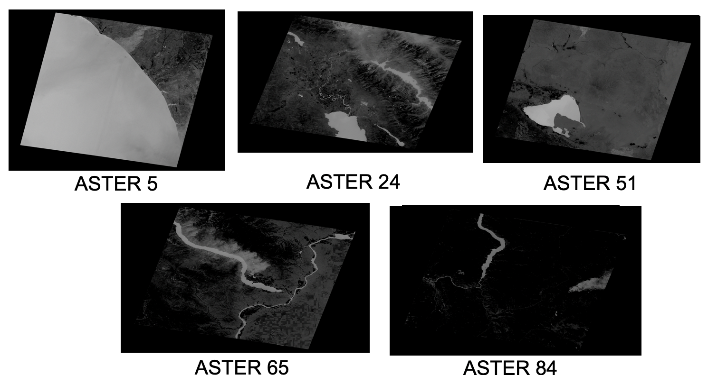
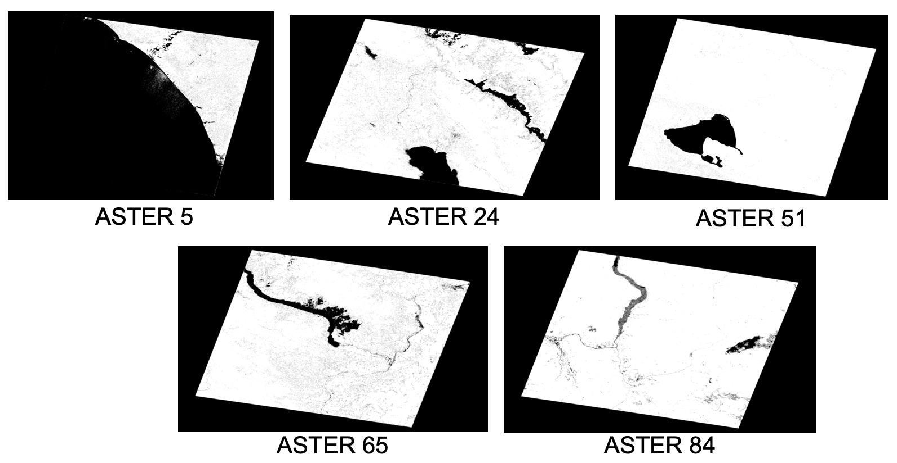
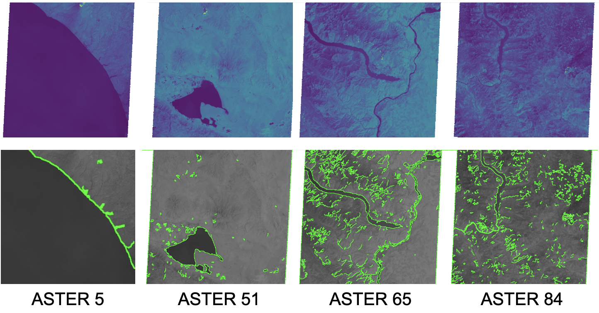
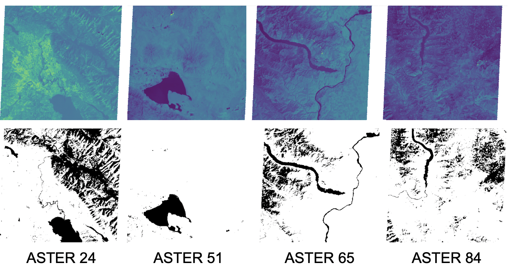
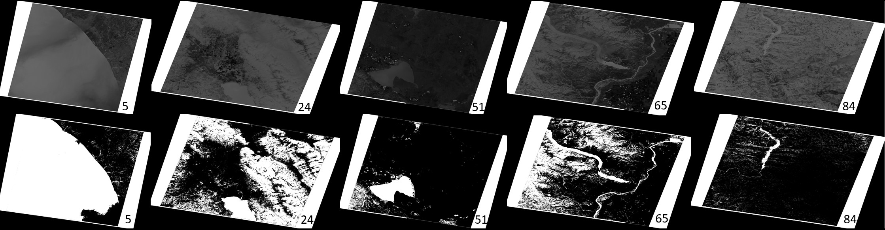

# Image processing for Satellite Imagery

**Provided open-source code is only an abstract of the fully developed object orianted code which remain confidintail**

## Install code's package requirements

`$ pip install -r requirements.txt`

* Used Python version 3.7.4
* Make sure you have GDAL and OpenCV on your system and liked to python
* Make sure to include your images dataset 
---

## Entry point after installing all requirements
from the code root dir run:

`$ python main.py`

* Refer to relevent files for running discuiption
* Each file have user guide included after run for hints as well

---

## Important For using experimental.py:

Using the following function should be as following:

1. Add file path of band for first_band.
2. Add file path of band for second_band.
3. Rely on the results of 32-bit the most.
4. NDVI 1st band Green, 2nd band NIR.
5. NDWI 1st bamd NIR, 2nd Red.
6. Experimantal 1st Green 2nd Red, and vise versia as well, only for the experimnt purpose

